# ML Predictive Scaling Architecture

## System Overview

This document describes the architecture of the ML Predictive Scaling system for Kubernetes resource forecasting using Prophet time series models.

## 🚀 Data Flow Overview (Start Here!)

**For newcomers**: Follow this numbered sequence to understand how the system works:

1. **① Data Collection**: Kubernetes cluster generates resource metrics → Prometheus collects them
2. **② Data Storage**: Historical metrics stored in MinIO as CSV files  
3. **③ ML Training**: 4-stage pipeline processes data and trains Prophet models
4. **④ Model Registry**: Trained models are registered and versioned in MLflow Model Registry
5. **⑤ API Serving**: FastAPI service loads models directly from MLflow Model Registry and provides predictions
6. **⑥ Consumption**: DevOps teams, Platform Engineers, and Automation tools consume forecasts

## Architecture Diagram

```mermaid
graph LR

    %% Data Sources (Left)
    subgraph Data_Sources
        K8S[⚙️ Kubernetes Cluster - Resource Metrics]
        PROM[📈 Prometheus - Monitoring & Metrics]
        K8S --> PROM
    end

    %% Data Storage (Center-Left)
    subgraph Data_Storage
        MINIO[🗄️ MinIO Object Storage - mlpipeline bucket]
        DATASET[📄 metrics_dataset.csv]
    end

    %% Model Registry
    subgraph Model_Registry
        MLFLOW[📦 MLflow Model Registry - Versioned Prophet Models]
        MODELS[🧠 Prophet Models - CPU & Memory]
    end

    %% ML Pipeline (Center)
    subgraph ML_Pipeline_Kubeflow
        DV[1️⃣ Data Validation - CSV quality checks]
        FE[2️⃣ Feature Engineering - Prophet prep]
        MT[3️⃣ Model Training - CPU/Memory models]
        MV[4️⃣ Model Validation - Performance checks]
        
        DV --> FE
        FE --> MT
        MT --> MV
    end

    %% Kubernetes Infrastructure (Center-Right)
    subgraph Kubernetes_Deployment
        subgraph Training_Infrastructure
            KF_NS[🔬 kubeflow namespace - pipeline execution]
            TRAIN_IMG[🐳 Docker: forecast-train image]
        end
        
        subgraph Serving_Infrastructure
            API_NS[🌐 forecast-api-modular namespace - API deployment]
            SERVE_IMG[🐳 Docker: forecast-serve image]
        end
    end

    %% API Layer (Right)
    subgraph API_Endpoints
        API[⚡ FastAPI Service - Production API]
        DAY[📅 next_day - Tomorrow]
        WEEK[📅 next_week - Weekly]
        MONTH[📅 next_month - Monthly]
        HEALTH[💚 health - Status Check]
        
        API --> DAY
        API --> WEEK
        API --> MONTH
        API --> HEALTH
    end

    %% Consumers (Far Right)
    subgraph Consumers
        DEVOPS[👷 DevOps Teams - Capacity planning]
        PLATFORM[🔧 Platform Engineers - Optimization]
        AUTO[🤖 Automation Tools - Auto-scaling]
    end

    %% Main Data Flow
    K8S -->|"① Live metrics"| PROM
    PROM -.->|"② Historical data"| DATASET
    DATASET -->|"③ Training data"| DV
    MV -->|"④ Register models"| MLFLOW
    MLFLOW -->|"⑤ Load models"| API
    API -->|"⑥ Predictions"| DEVOPS
    API --> PLATFORM
    API --> AUTO
    
    MINIO --> DATASET
    
    KF_NS --> DV
    KF_NS --> FE
    KF_NS --> MT
    KF_NS --> MV
    API_NS --> API

    TRAIN_IMG --> DV
    TRAIN_IMG --> FE
    TRAIN_IMG --> MT
    TRAIN_IMG --> MV
    SERVE_IMG --> API

    API --> DEVOPS
    API --> PLATFORM
    API --> AUTO

    classDef dataSource fill:#e3f2fd,stroke:#1565c0,color:#0d47a1
    classDef storage fill:#f3e5f5,stroke:#6a1b9a,color:#4a148c
    classDef pipeline fill:#e8f5e8,stroke:#2e7d32,color:#1b5e20
    classDef serving fill:#fff3e0,stroke:#ef6c00,color:#bf360c
    classDef infra fill:#fce4ec,stroke:#c2185b,color:#880e4f
    classDef client fill:#f1f8e9,stroke:#558b2f,color:#33691e
    classDef docker fill:#e1f5fe,stroke:#0277bd,color:#01579b

    class K8S,PROM dataSource
    class MINIO,DATASET,MODELS storage
    class DV,FE,MT,MV pipeline
    class API,DAY,WEEK,MONTH,HEALTH serving
    class KF_NS,API_NS infra
    class DEVOPS,PLATFORM,AUTO client
    class TRAIN_IMG,SERVE_IMG docker
```



## Key Components

### 📊 Data Sources
- **⚙️ Kubernetes Cluster**: Provides real-time resource metrics (CPU, memory usage)
- **📈 Prometheus**: Collects and aggregates Kubernetes metrics with time series data

### 💾 Data Storage  
- **🗄️ MinIO**: Object storage for datasets in `mlpipeline` bucket
- **📄 CSV Dataset**: Historical metrics data for training Prophet models

### 📦 Model Registry
- **📦 MLflow Model Registry**: Central registry for versioned Prophet models
- **🧠 Prophet Models**: Registered ML models for CPU and memory forecasting

### 🔬 ML Pipeline (Kubeflow)
- **1️⃣ Data Validation**: Validates CSV data quality and format
- **2️⃣ Feature Engineering**: Prepares time series data for Prophet training
- **3️⃣ Model Training**: Trains separate Prophet models for CPU and memory forecasting
- **4️⃣ Model Validation**: Validates model performance and accuracy

### ☸️ Kubernetes Infrastructure
- **🏗️ Training Infrastructure**: 
  - Namespace: `kubeflow`
  - Container: `sivakumark88/forecast-train:latest`
  - Purpose: Runs the 4-stage ML pipeline
  
- **🚀 Serving Infrastructure**:
  - Namespace: `forecast-api-modular`
  - Container: `shivapondicherry/forecast-serve:mlflow`
  - Purpose: Hosts the FastAPI prediction service, loads models from MLflow Model Registry

### 🌐 API Endpoints
- **⚡ FastAPI Service**: Production-ready REST API for resource forecasting
- **📅 Prediction Endpoints**:
  - `next_day`: Tomorrow's forecast (80-120% confidence)
  - `next_week`: Weekly forecast (80-120% confidence) 
  - `next_month`: Monthly forecast (70-150% confidence)
  - `health`: Service health check

### 👥 Consumer Applications
- **👷 DevOps Teams**: Use forecasts for capacity planning and resource allocation
- **🔧 Platform Engineers**: Optimize cluster resources based on predictions
- **🤖 Automation Tools**: Implement auto-scaling based on forecast recommendations

## Technical Architecture Details

### Docker Images
- **Training Image**: `sivakumark88/forecast-train:latest`
  - Contains Python, Prophet, Kubeflow SDK
  - Runs ML pipeline stages in Kubeflow
  
- **Serving Image**: `shivapondicherry/forecast-serve:mlflow`
  - Contains FastAPI, MLflow client, uvicorn
  - Loads models from MLflow Model Registry and provides REST API for predictions

### Data Flow
1. **📈 Metrics Collection**: Kubernetes → Prometheus → MinIO storage
2. **🔬 ML Training**: CSV data → 4-stage pipeline → Trained models
3. **📦 Model Registration**: Trained models → MLflow Model Registry (versioned)
4. **🌐 Prediction Serving**: Models (from MLflow) → FastAPI → JSON predictions
5. **👥 Consumption**: API → DevOps/Platform teams → Resource decisions

### Prediction Logic
- **Daily/Weekly**: 80-120% multipliers (conservative for short-term)
- **Monthly**: 70-150% multipliers (wider range for long-term uncertainty)
- **Prophet Configuration**: `yearly_seasonality=True`, `changepoint_prior_scale=0.05`

## Deployment Commands

### Build and Deploy Training Pipeline
```bash
# Generate pipeline YAML
python pipelines/modular_forecast_fixed.py

# Deploy to Kubeflow
kubectl apply -f pipelines/modular_forecast_test.yaml -n kubeflow
```

### Build and Deploy API Service (MLflow)
```bash
# Build serving image
docker build -f deployment/Dockerfile.serve -t shivapondicherry/forecast-serve:mlflow .

# Push image to registry
docker push shivapondicherry/forecast-serve:mlflow

# Deploy to Kubernetes
kubectl apply -f deployment/deployment-modular.yaml
```

## Monitoring and Observability

### Health Checks
- **API Health**: `GET /health` endpoint provides service status
- **Model Validation**: Pipeline stage 4 validates prediction quality
- **Kubernetes Health**: Standard K8s pod/deployment monitoring

### Logging
- **Pipeline Logs**: Available via `kubectl logs` in kubeflow namespace
- **API Logs**: Available via `kubectl logs` in forecast-api-modular namespace
- **Prometheus Metrics**: Standard FastAPI and Kubernetes metrics

This architecture provides a robust, scalable ML system for Kubernetes resource forecasting with clear separation of concerns between training and serving components.
